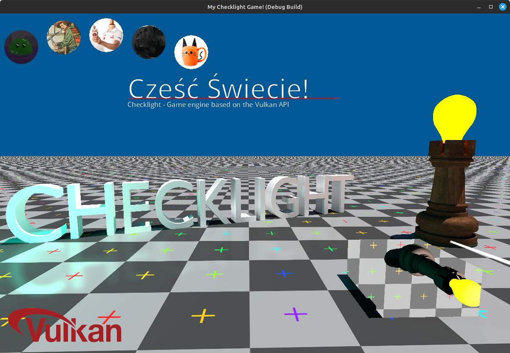

## Checklight Engine



### Vulkan Setup

- First make sure you have all development packages for vulkan installed, it can be done with those commands:
  
  - On Ubuntu: `sudo apt install vulkan-tools libvulkan-dev vulkan-validationlayers-dev spirv-tools`
  - On Fedora: `sudo dnf install vulkan-tools vulkan-loader-devel mesa-vulkan-devel vulkan-validation-layers-devel`
  - On Arch Linux: `sudo pacman -S vulkan-devel`

- You will also need the LUNARG Vulkan SDK, try running `sudo apt install vulkan-sdk` if that failes you will need to add the LUNARG PPA,
  for more info see https://vulkan.lunarg.com/sdk/home#linux (see the "Ubuntu Packages" section under Linux)

### Running

To run Checklight Engine execute the `checklight` cmake target, 
like so:

```bash
# Build
cmake . -B build -G Ninja
cmake --build build/ -j $(($(nproc --all) + 1))
cd build

# Execute demo
./checklight

# Run unit tests
./checklight_test
```

### Code Style

`PascalCase` classes  
`snake_case` variables  
`camelCase` methods  


